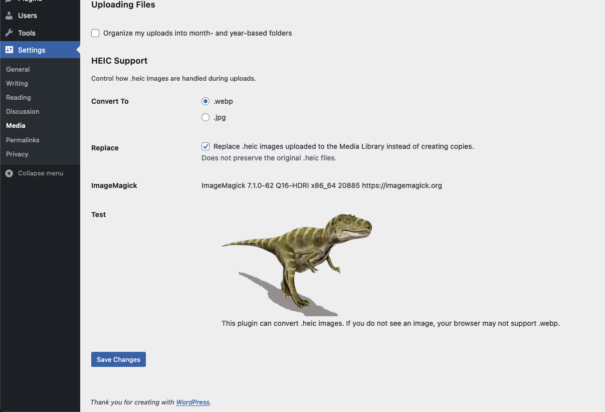

# HEIC Support

Allows .heic uploads to the Media Library. Creates .webp or .jpg copies of .heic images when they are uploaded. An optional feature replaces the original upload instead of creating a copy.

Creation of .webp copies usually works on servers running ImageMagick 7 or above. Check Settings → Media → HEIC Support after activating to see if your server provides ImageMagick.

Saves attachment IDs in meta key `_heic_support_copy_of` on both the uploaded .heic and the generated .webp attachment posts.

## Screenshot

The settings are located at Settings → Media → HEIC Support in the dashboard.

## Filters

`heic_support_extension`
Filters the file extension string "webp".

`heic_support_format`
Filters the image format passed to the `$imagick->setImageFormat()` method.

`heic_support_mime`
Filters the image mime type string "image/webp".

## Links

Plugin homepage
[breakfastco.xyz/heic-support/](https://breakfastco.xyz/heic-support/)

Project homepage
[github.com/csalzano/heic-support](https://github.com/csalzano/heic-support)

WordPress.org directory page
[wordpress.org/plugins/heic-support](https://wordpress.org/plugins/heic-support/)

ImageMagick homepage
[imagemagick.org](https://imagemagick.org/)