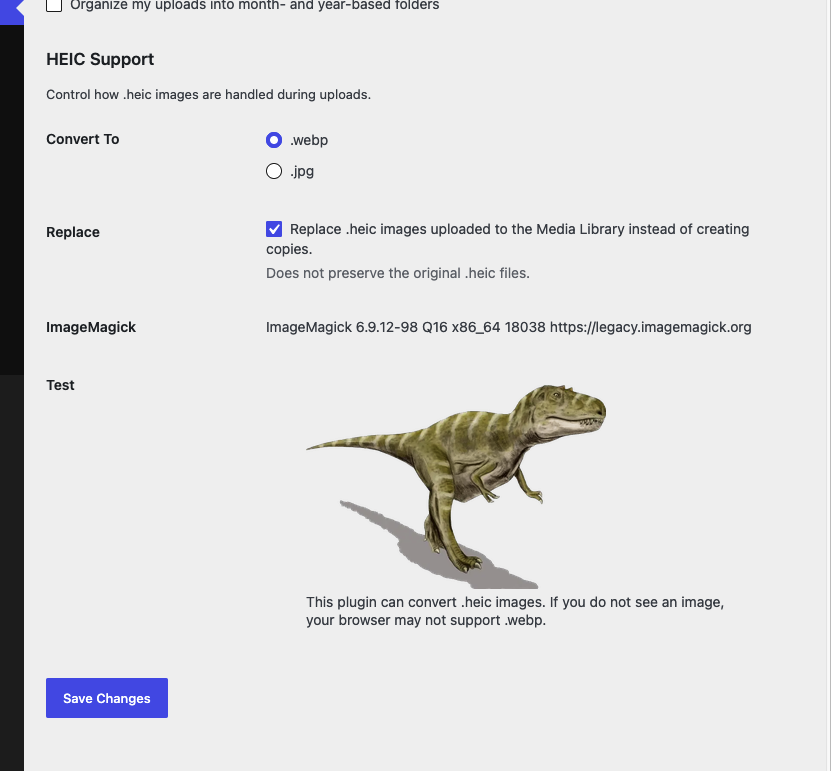
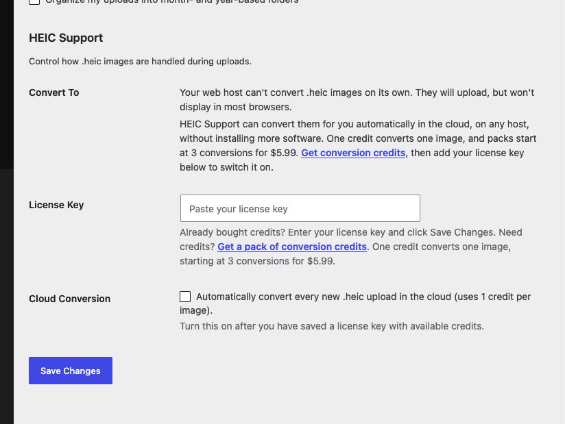

# HEIC Support

Allows .heic uploads to the Media Library. Creates .webp, .avif, or .jpg copies of .heic images when they are uploaded. An optional feature replaces the original upload instead of creating a copy.

Creation of .webp, .avif, or .jpg copies usually works on servers running ImageMagick 7 or above. Check Settings → Media → HEIC Support after activating to see if your server provides ImageMagick.

Saves attachment IDs in meta key `_heic_support_copy_of` on both the uploaded .heic and the generated .webp, .avif, or .jpg attachment posts.

Watch on YouTube at [https://youtu.be/iKW4mIjoVx8](https://youtu.be/iKW4mIjoVx8)

## Screenshots

The settings are located at Settings → Media → HEIC Support in the dashboard.

1. On a server that supports free conversion to .webp, .avif, or .jpg.

2. When the server does not support free conversion.

## Filters

`heic_support_extension`
Filters the file extension string ("webp", "avif", or "jpg").

`heic_support_format`
Filters the image format passed to the `$imagick->setImageFormat()` method.

`heic_support_mime`
Filters the image mime type string ("image/webp", "image/avif", or "image/jpeg").

## Links

Plugin homepage
[breakfastco.xyz/heic-support/](https://breakfastco.xyz/heic-support/)

Project homepage
[github.com/csalzano/heic-support](https://github.com/csalzano/heic-support)

WordPress.org directory page
[wordpress.org/plugins/heic-support](https://wordpress.org/plugins/heic-support/)

ImageMagick homepage
[imagemagick.org](https://imagemagick.org/)
